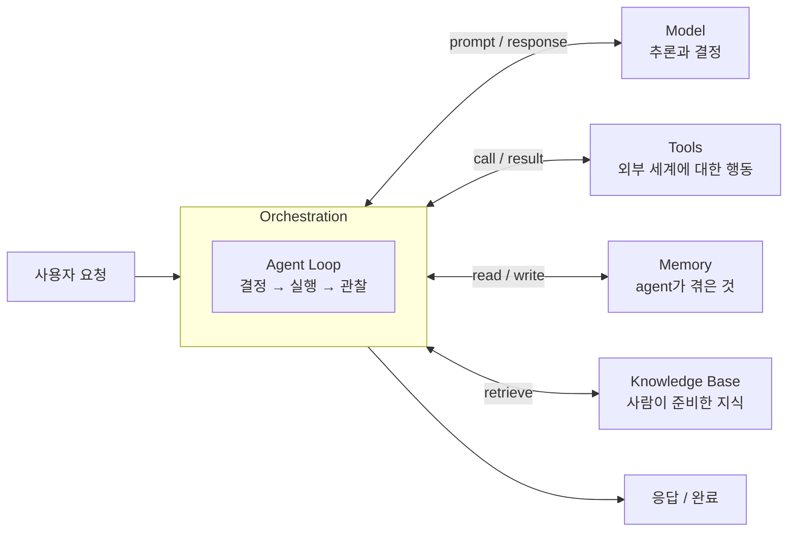
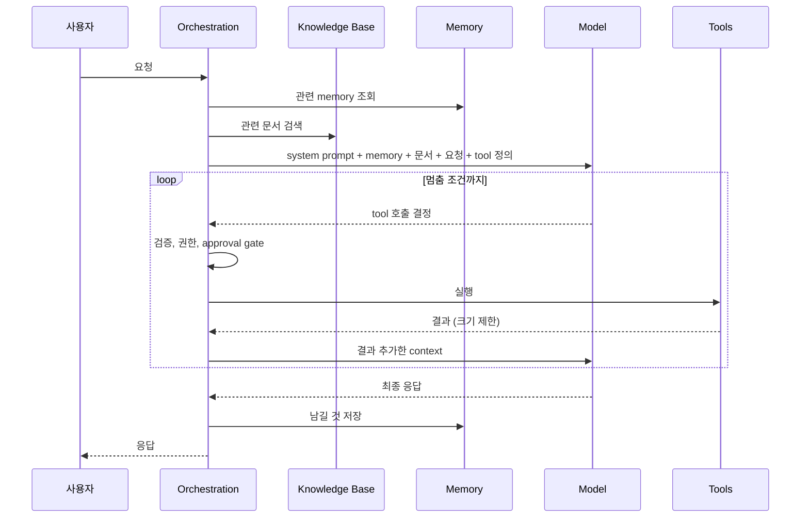

# 에이전트 시스템의 핵심 구성요소 — Model, Tools, Memory, Knowledge Base, 그리고 Orchestration

> **교육자료.** 대상: LLM API는 써봤지만 agent를 처음 설계하는 개발자. 소요 시간: 읽기 30분, 연습문제 30분.
>
> 이 문서는 "무엇으로 이루어져 있나"를 다룬다. "어떻게 잘 만드나"는 [효과적인 Agentic System을 만드는 5가지 원칙](agentic-system-principles.md)에서 다룬다.

## 학습 목표

이 문서를 읽고 나면 다음을 할 수 있어야 한다.

1. Agent 시스템을 **Model, Tools, Memory, Knowledge Base** 네 구성요소와 이를 묶는 **Orchestration**으로 분해해 설명한다
2. 하나의 사용자 요청이 다섯 요소를 어떤 순서로 거치는지 추적한다
3. Memory와 Knowledge Base의 차이를 말하고, 어떤 정보가 어디에 가야 하는지 판단한다
4. "Agent가 이상하게 동작한다"는 증상을 보고 어느 구성요소의 문제인지 좁힌다

---

## 1. 큰 그림

Chatbot과 agent의 차이는 하나다. Chatbot은 **답을 생성**하고 끝난다. Agent는 **행동을 결정하고, 실행하고, 결과를 보고, 다시 결정**한다. 이 loop를 돌리려면 모델 하나로는 부족하다.



| 구성요소 | 한 줄 정의 | 비유 |
|---|---|---|
| **Model** | 주어진 context를 보고 다음 행동을 결정한다 | 판단하는 사람 |
| **Tools** | 모델이 세계를 읽고 바꾸는 손발 | 손, 눈 |
| **Memory** | agent가 스스로 겪고 쌓은 상태 | 경험, 수첩 |
| **Knowledge Base** | 사람이 미리 준비해둔 신뢰할 수 있는 지식 | 참고 서적, 사내 문서 |
| **Orchestration** | 위 넷을 언제 어떤 순서로 쓸지 제어하는 코드 | 업무 절차, 관리자 |

**핵심 주장: Orchestration이 없으면 나머지 넷은 부품일 뿐이다.** 좋은 모델, 좋은 도구, 좋은 문서를 갖고도 agent가 헛도는 팀은 대부분 이 다섯 번째 요소를 설계하지 않았다. "모델에 다 넣어주면 알아서 하겠지"가 orchestration 부재의 전형적인 형태다.

---

## 2. Model — 결정하는 부품

### 역할

Model이 하는 일은 정확히 하나다. **현재 context를 입력받아 다음 행동을 출력한다.** 다음 행동은 세 종류 중 하나다.

- 사용자에게 답한다 (텍스트 생성)
- Tool을 호출한다 (tool name + arguments)
- 생각을 정리한다 (reasoning, 다음 턴의 입력이 됨)

Model은 세계를 직접 보지 못하고, 기억하지 못하고, 행동하지 못한다. 전부 다른 구성요소가 context에 넣어준 것만 본다. 이 점을 이해하면 많은 오해가 풀린다. "모델이 최신 정보를 모른다"는 모델 문제가 아니라 knowledge base 문제고, "모델이 지난 대화를 잊었다"는 memory 문제다.

### 설계 결정

| 결정 | 선택지 | 판단 기준 |
|---|---|---|
| 모델 크기 | 큰 모델 하나 vs 단계별 tiering | 단계마다 필요한 판단의 난이도가 다른가 |
| Reasoning | 생각 과정을 노출할지, 얼마나 길게 | 다단계 계획이 필요한 작업인가 |
| 출력 형식 | 자유 텍스트 vs structured output | 결과를 코드가 파싱해야 하는가 |
| Temperature | 결정적 vs 다양성 | 재현성이 중요한가, 창의성이 중요한가 |

### 흔한 착각

- **"모델을 바꾸면 agent가 좋아진다."** 나머지 넷이 부실하면 좋은 모델은 더 자신 있게 틀린다. 모델 교체는 병목이 모델임을 확인한 뒤에 한다
- **"Prompt에 규칙을 쓰면 지켜진다."** 확률적으로 지켜진다. 반드시 지켜져야 하는 규칙은 orchestration 코드에서 강제한다

---

## 3. Tools — 세계에 닿는 부품

### 역할

Tool은 모델이 **읽기**(검색, 파일 열기, DB 조회)와 **쓰기**(파일 수정, API 호출, 메시지 발송)를 할 수 있게 하는 함수다. 모델은 tool의 이름, 설명, 입력 schema만 보고 호출을 결정한다. 실제 실행은 orchestration이 한다.

```
Model이 보는 것                      Orchestration이 하는 것
─────────────────────────────       ─────────────────────────────
name: search_tickets                1. 인자 schema 검증
description: 고객 지원 티켓을         2. 권한 확인 (이 agent가 이 tool을 쓸 수 있나)
  키워드로 검색한다                   3. 실행
input: { query: string,             4. 결과를 크기 제한에 맞게 자름
         status?: "open"|"closed" } 5. 결과를 context에 추가
```

### 좋은 Tool의 조건

| 조건 | 이유 |
|---|---|
| **이름과 설명만으로 효과를 안다** | 모델은 문서를 읽지 않는다. 이름이 곧 문서다 |
| **Single responsibility** | `manage_ticket(action, ...)`보다 `create_ticket`, `close_ticket`이 낫다. 모델의 선택지가 명확해진다 |
| **결과 크기를 스스로 제한한다** | 10MB를 돌려주면 context가 끝난다. 잘라서 주고 "더 있음"을 표시한다 |
| **실패를 결과로 돌려준다** | 예외로 죽지 않고 "파일이 없다"를 문자열로 돌려주면 모델이 우회한다 |
| **Idempotency를 표시한다** | Orchestration이 retry 여부를 결정하는 근거 |
| **위험도를 표시한다** | 읽기 / 되돌릴 수 있는 쓰기 / 되돌릴 수 없는 쓰기. Approval gate의 근거 |

### 흔한 착각

- **"Tool을 많이 주면 더 많이 할 수 있다."** 40개를 주면 비슷한 이름끼리 헷갈리고, 정의만으로 context를 수천 토큰 쓴다. 작업에 필요한 것만 노출한다
- **"Tool은 API wrapper다."** API를 그대로 노출하면 인자가 20개짜리 tool이 나온다. Tool은 모델이 쓰기 좋게 다시 설계한 interface다

---

## 4. Memory — Agent가 겪은 것

### 역할

Memory는 **agent 자신의 운영 과정에서 생긴 상태**다. 사용자가 방금 한 말, 세 턴 전에 호출한 tool의 결과, 지난주 세션에서 알게 된 사용자 선호. 특징은 두 가지다. **Agent가 쓴다**(사람이 준비한 게 아니다), 그리고 **계속 변한다.**

Memory는 수명에 따라 층이 나뉜다.

```
                       수명        저장 위치           예
────────────────────────────────────────────────────────────────────
Working memory         한 턴       context window      지금 읽은 파일 내용
Session memory         한 세션     context + 외부 저장  이 대화에서 결정한 사항
Long-term memory       세션 간     외부 저장 (DB, 파일)  사용자는 tab 대신 space를 쓴다
Episodic memory        세션 간     외부 저장            지난번 이 작업은 X 방식으로 실패했다
```

### 설계 결정

**무엇을 기억할지는 orchestration이 정한다.** 모델이 모든 것을 기억하게 두면 context가 폭발하고, 아무것도 기억 못 하게 두면 매 세션 처음부터 시작한다. 중간이 필요하다.

- **Context 관리**: 세션이 길어지면 오래된 턴을 요약하거나 버린다. 무엇을 남길지가 품질을 결정한다
- **저장 시점**: 세션 끝에 한 번, 혹은 중요한 사실이 나올 때마다
- **검증**: 저장하기 전에 사실인지, 이미 있는 것과 충돌하지 않는지
- **만료와 삭제**: 출처와 시점을 붙이고, 오래되거나 틀린 것을 지울 수 있게

### 흔한 착각

- **"Memory는 많을수록 좋다."** 잘못 저장된 "사용자는 X를 선호한다"는 이후 모든 세션을 오염시킨다. 잘못 배우는 것도 학습이다
- **"대화 history가 곧 memory다."** History는 raw data다. Memory는 거기서 남길 것을 골라낸 결과다

---

## 5. Knowledge Base — 사람이 준비한 지식

### 역할

Knowledge Base는 **agent 밖에서 사람이나 파이프라인이 준비하고 관리하는 지식**이다. 사내 문서, 제품 매뉴얼, 코드베이스, 정책 문서, 과거 티켓 아카이브. 모델의 학습 데이터에 없거나, 있어도 오래된 정보를 실행 시점에 제공하는 통로다.

특징은 memory와 정반대다. **Agent가 쓰지 않는다**(읽기 전용에 가깝다), **소유자가 따로 있다**(문서 담당자, 데이터 파이프라인), **정답으로 취급된다**(agent의 추측보다 우선한다).

### Memory vs Knowledge Base

둘을 가장 많이 혼동한다. 구분 기준은 **누가 썼고, 누가 책임지나**다.

| | Memory | Knowledge Base |
|---|---|---|
| 누가 쓰나 | Agent | 사람, 파이프라인 |
| 내용 | Agent가 겪은 것 | 조직이 아는 것 |
| 변화 | 매 세션 | 문서가 갱신될 때 |
| 신뢰도 | 검증 필요 | 정답으로 취급 |
| 예 | "이 사용자는 PR 설명을 짧게 원한다" | "배포 절차는 staging → canary → prod 순이다" |
| 잘못됐을 때 | 지운다 | 문서 담당자에게 고치라고 한다 |

**판별 연습:** "지난번 배포에서 canary 단계가 30분 걸렸다"는 어디에 가나? → Memory(episodic). Agent가 겪은 사실이고, 다음에 달라질 수 있다. "Canary 단계는 최소 15분 유지해야 한다"는? → Knowledge Base. 조직의 규칙이고 agent가 바꿀 수 없다.

### 설계 결정

| 결정 | 내용 |
|---|---|
| **검색 방식** | Keyword, vector(embedding), hybrid, 혹은 tool로 구조화된 조회(DB query). 문서가 아니라 표라면 vector search가 아니라 SQL이 맞다 |
| **Chunking** | 문서를 어떤 단위로 자를지. 너무 작으면 문맥이 끊기고, 너무 크면 context를 낭비한다 |
| **신선도** | 원본이 바뀌면 언제 반영되나. 오래된 문서를 정답으로 주는 것이 최악의 실패다 |
| **출처 표시** | 모델이 어느 문서를 근거로 답했는지 남긴다. 검증과 디버깅의 시작점 |
| **접근 제어** | 사용자가 볼 권한 없는 문서를 agent가 읽어서 답하면 안 된다 |

### 흔한 착각

- **"RAG를 붙이면 knowledge base가 된다."** RAG는 검색 방식 하나다. 문서가 오래됐고 chunking이 엉망이면 RAG는 틀린 문서를 자신 있게 찾아준다
- **"모델이 알고 있으니 knowledge base는 필요 없다."** 모델의 지식은 학습 시점에 멈춰 있고, 조직 내부 정보는 애초에 없다

---

## 6. Orchestration — 넷을 하나로 만드는 부품

### 역할

Orchestration은 **agent loop를 돌리는 코드**다. 모델에 무엇을 보여줄지, 모델의 결정을 어떻게 실행할지, 결과를 어디에 저장할지, 언제 멈출지를 정한다. 프롬프트가 아니라 코드다.



### Orchestration이 결정하는 것

| 결정 | 없으면 |
|---|---|
| **Context 구성**: 어떤 memory, 어떤 문서, 어떤 tool을 이 턴에 보여줄지 | 전부 넣어서 context 폭발, 혹은 필요한 걸 안 넣어서 모델이 추측 |
| **실행 제어**: 검증, 권한, approval, retry, timeout | 환각된 인자로 파일 삭제, 결제 두 번 |
| **멈춤 조건**: max steps, 비용 상한, 반복 감지 | 같은 tool을 400번 호출 |
| **상태 관리**: 무엇을 memory에 남기고, 무엇을 버릴지 | 아무것도 기억 못 하거나, 틀린 것을 영원히 기억 |
| **분해와 위임**: 큰 작업을 sub-agent로 나누고 결과만 합칠지 | 한 context에서 30개 파일을 읽다가 처음 지시를 잊음 |
| **관측**: 모든 호출의 입력/출력/비용 기록 | "가끔 이상해요"를 재현할 수 없음 |

### Orchestration 패턴

| 패턴 | 구조 | 적합한 경우 |
|---|---|---|
| **Single agent loop** | 모델 하나가 tool을 부르며 끝까지 | 단계가 적고 context가 작은 작업 |
| **Orchestrator–workers** | 상위 agent가 분해, 하위 agent가 각자 처리, 결과 합침 | 병렬 가능한 조사, 큰 코드베이스 탐색 |
| **Pipeline** | 정해진 순서로 단계별 agent | 절차가 고정된 업무 (분류 → 조회 → 작성 → 검토) |
| **Router** | 첫 단계에서 요청 유형을 판별해 전담 agent로 | 요청 종류가 몇 가지로 명확히 나뉠 때 |
| **Evaluator loop** | 생성 agent와 검증 agent가 번갈아 | 품질 기준이 명확하고 검증이 생성보다 쉬울 때 |

**원칙: 코드로 정할 수 있는 것은 코드로 정한다.** 요청 유형이 세 가지로 명확하면 router는 `if`문이어도 된다. 모델에게 "알아서 판단하라"고 맡기는 것은 코드로 정할 수 없을 때의 선택이다.

---

## 7. Worked Example — 요청 하나를 끝까지 따라가기

**시나리오:** 사내 개발자 지원 agent. 사용자가 묻는다.

> "staging 배포가 어제부터 계속 실패해요. 왜 그런지 봐주고 담당팀에 티켓 열어주세요."

### 다섯 요소가 각각 하는 일

| 단계 | 구성요소 | 일어나는 일 |
|---|---|---|
| 1 | **Orchestration** | 요청 수신. 사용자 ID로 권한 확인. Trace 시작 |
| 2 | **Memory** | 이 사용자의 long-term memory 조회: "팀 = platform, 담당 서비스 = auth-api". Episodic: "2주 전 staging 실패 원인은 인증서 만료였다" |
| 3 | **Knowledge Base** | "staging 배포"로 검색 → 배포 절차 문서, 장애 대응 runbook, 티켓 생성 정책(어느 팀에, 어떤 template으로) |
| 4 | **Orchestration** | Context 구성: system prompt + memory 2건 + 문서 3건 요약 + 요청 + 이 agent에 허용된 tool 5개 정의. 이 턴에 `delete_*` 계열 tool은 노출하지 않음 |
| 5 | **Model** | 결정: `get_deploy_logs(service="auth-api", env="staging", since="yesterday")` 호출 |
| 6 | **Orchestration → Tools** | 인자 schema 검증 통과. 읽기 tool이므로 approval 불필요. 실행. 결과 4MB → 마지막 200줄 + 오류 라인만 추출해 반환 |
| 7 | **Model** | 로그에서 `x509: certificate has expired` 발견. Episodic memory의 "2주 전 인증서 만료"와 연결. 결정: `search_tickets(query="staging certificate", status="open")` |
| 8 | **Tools** | 결과: 열린 티켓 없음 |
| 9 | **Model** | 결정: `create_ticket(team="platform", title=..., body=...)` 호출 |
| 10 | **Orchestration** | `create_ticket`은 외부에 영향을 주는 쓰기 tool → **approval gate**. 사용자에게 티켓 초안 보여주고 확인 요청 |
| 11 | 사용자 | 승인 |
| 12 | **Tools** | 티켓 생성. ID 반환 |
| 13 | **Model** | 최종 응답 작성: 원인(인증서 만료), 근거(로그 라인, 2주 전 사례), 조치(티켓 링크) |
| 14 | **Orchestration → Memory** | Episodic memory 저장: "staging auth-api 실패, 원인 인증서 만료, 2회째, 티켓 #1234". Long-term에는 새로 배울 것 없음 |
| 15 | **Orchestration** | Trace 종료. Step 4회, 토큰 수, 비용, 소요 시간 기록 |

### 어느 하나가 빠지면

| 빠진 것 | 결과 |
|---|---|
| Memory 없음 | "2주 전에도 같은 일이 있었다"를 모른다. 매번 처음 보는 문제처럼 조사한다 |
| Knowledge Base 없음 | 티켓을 어느 팀에 어떤 형식으로 열어야 하는지 모른다. 모델이 추측해서 잘못된 팀에 연다 |
| Tools 없음 | 로그를 볼 수 없다. "인증서를 확인해보세요"라는 일반론으로 답한다 |
| Orchestration 없음 | 4MB 로그가 그대로 context에 들어간다. `create_ticket`이 확인 없이 실행된다. 이번 사례가 memory에 남지 않는다 |
| Model 없음 | 나머지 넷은 있어도 "로그를 보고 티켓을 열자"는 판단을 할 주체가 없다 |

---

## 8. 증상으로 구성요소 찾기

운영 중 문제가 생기면 다섯 요소 중 어디인지 먼저 좁힌다.

| 증상 | 의심할 곳 | 확인 방법 |
|---|---|---|
| 최신 정보를 모른다, 사내 규칙과 다르게 답한다 | Knowledge Base | 검색 결과에 해당 문서가 들어갔나? 문서가 최신인가? |
| 지난 대화/세션 내용을 잊는다 | Memory, Orchestration의 context 관리 | 저장은 됐나? 이번 턴 context에 들어갔나? |
| 없는 파일, 잘못된 ID로 tool을 부른다 | Model (hallucination) → Orchestration이 막아야 | 인자 검증이 있나? 존재 확인 후 실행하나? |
| 같은 tool을 반복 호출한다 | Orchestration (멈춤 조건), Tool (오류를 안 돌려줌) | 반복 감지가 있나? Tool이 실패를 결과로 돌려주나? |
| 답은 맞는데 너무 느리고 비싸다 | Orchestration (context 구성), Model (tiering) | 매 턴 context 크기는? 쉬운 단계에 큰 모델을 쓰나? |
| 하면 안 되는 행동을 했다 | Orchestration (권한, approval gate) | 그 tool이 왜 노출됐나? Gate가 왜 안 걸렸나? |
| 가끔 이상한데 재현이 안 된다 | Orchestration (관측 부재) | Trace가 있나? 없으면 이것부터 |

---

## 연습문제

**1. 분류.** 다음 정보는 Memory와 Knowledge Base 중 어디에 가야 하나? 이유를 한 줄로.
- (a) 회사 휴가 정책 문서
- (b) 이 사용자가 지난주에 "답변은 영어로"라고 요청한 사실
- (c) 어제 배포 실패의 로그 요약
- (d) 제품 API reference
- (e) 이 agent가 지난달 `deploy` tool 호출에서 timeout을 5번 겪은 기록

**2. Tool 설계.** 다음 tool 정의의 문제를 세 가지 이상 찾고 고쳐라.
```
name: db
description: 데이터베이스 작업
input: { sql: string }
```

**3. Orchestration.** Worked example의 10단계에서 approval gate가 없었다면 어떤 문제가 생길 수 있나? 반대로 6단계(로그 조회)에도 approval을 요구하면 어떤 문제가 생기나?

**4. 진단.** Agent가 "우리 회사 배포 절차는 dev → prod 순입니다"라고 답했다. 실제 절차는 dev → staging → prod다. 어느 구성요소를 어떤 순서로 확인하겠나?

**5. 설계.** "고객 문의 이메일을 읽고, 관련 주문을 조회해서, 답장 초안을 쓰는" agent를 다섯 구성요소로 분해하라. 각 요소에 무엇이 들어가는지, orchestration이 어디에 gate를 둘지 적어라.

<details>
<summary>연습문제 1 답</summary>

- (a) Knowledge Base. 조직이 소유하고 관리하는 문서
- (b) Memory (long-term). Agent가 사용자와의 상호작용에서 알게 된 선호
- (c) Memory (episodic). Agent가 겪은 사건. 단, 조직 차원의 postmortem 문서가 되면 그때는 Knowledge Base
- (d) Knowledge Base. 사람이 관리하는 정답
- (e) Memory (episodic). Agent 자신의 운영 기록. 이걸 근거로 orchestration이 timeout 값을 조정할 수 있다

</details>

---

## 요약

- Agent는 **Model, Tools, Memory, Knowledge Base**를 **Orchestration**이 묶은 것이다
- Model은 결정만 한다. 보고, 기억하고, 행동하는 것은 나머지가 context에 넣어준 것으로 한다
- Memory는 agent가 겪은 것, Knowledge Base는 사람이 준비한 것. **누가 썼고 누가 책임지나**로 구분한다
- Orchestration은 prompt가 아니라 코드다. Context 구성, 실행 제어, 멈춤 조건, 상태 관리, 관측을 담당한다
- 문제가 생기면 증상으로 구성요소를 먼저 좁힌다. Trace가 없으면 그것부터 만든다
