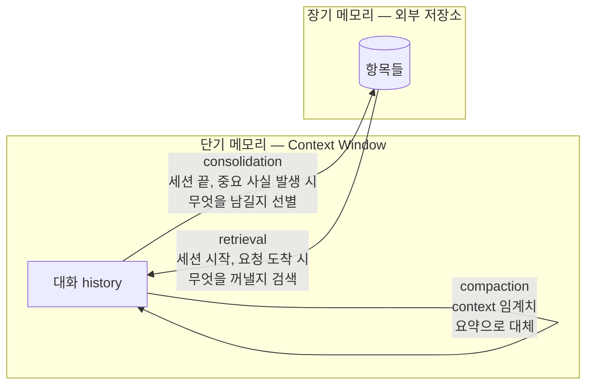

# 에이전트의 단기 메모리와 장기 메모리 — Context Window와 외부 저장소 사이

Agent가 "기억한다"는 말은 두 가지 전혀 다른 것을 뜻한다.

- **지금 이 대화에서** 세 턴 전에 읽은 파일 내용을 기억한다
- **지난주 세션에서** 사용자가 "PR 설명은 짧게"라고 했던 것을 기억한다

첫 번째는 context window 안에 있다. 두 번째는 어딘가 바깥에 저장돼 있다가 꺼내온 것이다. 둘은 저장 위치, 수명, 용량, 비용, 실패 방식이 전부 다르다. 그런데 대부분의 agent는 둘을 구분하지 않고 "메모리"라고 부르며, 그래서 한쪽 문제를 다른 쪽 해법으로 풀려다 실패한다.

이 문서는 둘을 **단기 메모리(short-term)**와 **장기 메모리(long-term)**로 나누고, 각각의 설계와 둘 사이의 이동을 다룬다.

> [핵심 구성요소](agent-core-components.md)에서 memory를 4층(working, session, long-term, episodic)으로 나눴다. 이 문서에서는 앞의 둘을 단기, 뒤의 둘을 장기로 묶어 더 깊이 본다. Memory와 Knowledge Base의 구분은 그 문서를 참고.

---

## 1. 두 메모리의 비교

컴퓨터의 메모리 계층과 정확히 대응한다. RAM은 빠르고 작고 전원이 꺼지면 사라진다. 디스크는 느리고 크고 남는다.

| | 단기 메모리 | 장기 메모리 |
|---|---|---|
| **위치** | Context window | 외부 저장소 (파일, DB, vector store) |
| **수명** | 이 세션, 혹은 이 턴 | 세션을 넘어 지속 |
| **용량** | 고정, 유한 (수십만 토큰) | 사실상 무한 |
| **접근** | 모델이 전부 본다. 검색 불필요 | 검색해서 꺼내와야 보인다 |
| **비용** | 매 턴 전체를 다시 읽는다. 크기 × 턴 수 | 저장은 싸고, 검색과 주입에 비용 |
| **쓰는 주체** | Orchestration이 자동으로 채운다 | 명시적으로 저장을 결정해야 한다 |
| **실패 방식** | 넘친다, 흐려진다 | 틀린 것이 남는다, 필요한 것을 못 찾는다 |
| **비유** | RAM, 작업 기억 | 디스크, 장기 기억 |

가장 중요한 차이는 **접근 방식**이다. 단기 메모리에 있는 것은 모델이 무조건 본다. 장기 메모리에 있는 것은 **꺼내와서 단기 메모리에 넣어야** 모델이 본다. 장기 메모리가 아무리 정확해도 검색이 실패하면 없는 것과 같다.

---

## 2. 단기 메모리 — Context Window 관리

### 무엇이 들어 있나

한 턴에 모델이 보는 context는 대략 이렇게 구성된다.

```
┌─────────────────────────────────────┐
│ System prompt                       │  고정. 역할, 규칙
│ Tool 정의                            │  고정. 수십 개면 수천 토큰
│ 장기 메모리에서 꺼내온 것              │  턴마다 다름. 이 사용자, 이 작업 관련
│ Knowledge base에서 검색한 것          │  턴마다 다름
├─────────────────────────────────────┤
│ 대화 history                         │  ← 여기가 자란다
│   사용자 메시지 1                     │
│   모델 응답 1 (tool 호출)             │
│   tool 결과 1                        │  ← 대부분 여기서 폭발
│   모델 응답 2                        │
│   ...                               │
│   사용자 메시지 N                     │
└─────────────────────────────────────┘
```

위쪽은 매 턴 비슷하다. 아래쪽 history가 턴마다 자라고, 그중에서도 **tool 결과**가 가장 크다. 파일 하나 읽으면 수천 토큰, 로그 한 번 조회하면 수만 토큰이 들어온다.

### 왜 관리해야 하나

용량이 유한하다는 것은 절반의 이유다. 나머지 절반은 **채워질수록 품질이 떨어진다**는 것이다.

- **비용**: 매 턴 context 전체를 다시 읽는다. 100k 토큰 context에서 50턴 대화면 500만 토큰이다
- **Latency**: 입력이 길수록 첫 토큰까지 오래 걸린다
- **정확도**: 긴 context에서 모델은 중간 부분을 놓치고(lost in the middle), 초반의 지시를 잊고, 오래된 tool 결과를 최신인 줄 안다
- **오염**: 실패한 시도의 흔적이 남아 다음 시도에 영향을 준다

"Context가 크니까 다 넣어도 된다"는 용량만 본 것이다. 넣을 수 있는 것과 넣어야 하는 것은 다르다.

### 관리 기법

| 기법 | 내용 | 언제 |
|---|---|---|
| **Tool 결과 자르기** | Tool이 결과를 돌려줄 때부터 크기를 제한. 앞뒤 N줄, 오류 라인만, "더 있음" 표시 | 항상. 가장 효과가 크고 가장 쉽다 |
| **오래된 tool 결과 지우기** | 이미 처리가 끝난 tool 결과를 "[결과 생략: 파일 X 읽음]"으로 대체 | 같은 파일을 다시 읽거나 수정한 뒤 |
| **요약 (compaction)** | 오래된 history를 요약으로 대체. 결정 사항, 진행 상태, 남은 일을 남기고 과정은 버린다 | Context가 임계치를 넘을 때 |
| **Sub-agent 격리** | 큰 조사를 sub-agent에 맡기고 결론만 받는다. 30개 파일은 sub-agent의 context에서 끝난다 | 탐색, 조사, 여러 파일 읽기 |
| **참조로 대체** | 큰 데이터는 context에 넣지 않고 파일로 저장한 뒤 경로만 넣는다. 필요하면 다시 읽는다 | 데이터셋, 긴 로그, 생성한 산출물 |
| **Tool 정의 최소화** | 이 작업에 필요한 tool만 노출한다 | 도구가 10개를 넘을 때 |

### 요약(compaction)에서 무엇을 남기나

요약은 손실 압축이다. 잘못 요약하면 모델은 압축된 과거를 사실로 믿는다. 남겨야 하는 것과 버려도 되는 것의 기준:

| 남긴다 | 버린다 |
|---|---|
| 사용자의 원래 요청과 제약 조건 | 중간 탐색 과정 |
| 내린 결정과 그 이유 | 결정에 이르기까지 검토한 대안들 |
| 현재 상태 (수정한 파일, 실행한 명령) | Tool 결과의 원문 |
| 남은 일 | 이미 끝난 일의 세부 |
| 실패한 시도와 원인 ("X는 Y 때문에 안 됨") | 실패한 시도의 전체 로그 |

마지막 줄이 중요하다. 실패한 시도를 통째로 버리면 모델은 같은 시도를 반복한다. 원인 한 줄은 남겨야 한다.

### 안티패턴

- **모든 tool 결과를 원문 그대로 유지.** 10턴 뒤에는 첫 턴에 읽은 파일이 이미 수정됐는데 옛 내용이 context에 남아 있다. 모델은 어느 쪽이 최신인지 모른다
- **Compaction 없이 세션 무한 연장.** 어느 순간 모델이 처음 지시를 잊고 엉뚱한 방향으로 간다. 사용자는 "왜 갑자기 이상해졌지"라고 느낀다
- **너무 이른 compaction.** 아직 참조할 정보를 요약해버리면 모델이 다시 읽으러 간다. 요약으로 절약한 것보다 재조회 비용이 크다

---

## 3. 장기 메모리 — 세션을 넘어 남기기

### 무엇을 저장하나

장기 메모리의 첫 질문은 "어떻게 저장하나"가 아니라 **"무엇을 저장할 가치가 있나"**다. 전부 저장하면 검색이 어려워지고 틀린 것이 섞인다. 기준은 **다음 세션에서 이걸 모르면 같은 실수를 하거나 같은 질문을 다시 하게 되는가**다.

| 종류 | 예 | 출처 |
|---|---|---|
| **사용자 선호** | "PR 설명은 짧게", "테스트는 pytest", "한국어로 답해" | 사용자가 직접 말함, 혹은 반복 교정 |
| **사용자·환경 사실** | 역할, 주 프로젝트, 로컬 환경 특성 (Windows, 특정 도구 없음) | 대화에서 드러남 |
| **작업 맥락** | 진행 중인 작업, 결정 사항, 다음에 할 일 | 세션 종료 시 |
| **Episodic** | "X 방식으로 시도했더니 Y 때문에 실패", "이 저장소는 빌드에 10분 걸림" | Agent가 겪음 |
| **교정** | 사용자가 agent의 행동을 고친 것과 이유 | 사용자 피드백 |

저장하지 않는 것: 코드에서 읽을 수 있는 것(구조, 함수 이름), git history에 있는 것, knowledge base에 있는 것, 이 세션에만 의미 있는 것. **다른 곳에서 확인할 수 있는 것을 memory에 복사하면 두 사본이 갈라진다.**

### 저장 형식

저장 단위는 **하나의 사실, 하나의 항목**이 좋다. 큰 문서 하나에 다 쓰면 일부만 틀렸을 때 수정과 삭제가 어렵고, 검색 시 관련 없는 부분까지 끌려온다.

각 항목에 붙일 메타데이터:

| 필드 | 이유 |
|---|---|
| **종류** | 선호 / 사실 / episodic / 교정. 검색과 만료 정책이 달라진다 |
| **출처** | 사용자가 직접 말했나, agent가 추론했나. 신뢰도가 다르다 |
| **시점** | 언제 알게 됐나. 오래된 것은 재확인 대상 |
| **근거** | 어느 대화, 어느 사건에서. 틀렸을 때 추적용 |
| **범위** | 이 프로젝트만인가, 사용자 전체인가 |

한 줄 요약(description)을 따로 두면 검색 단계에서 본문을 다 읽지 않고 관련성을 판단할 수 있다.

### 검색 (retrieval)

장기 메모리는 꺼내와야 보인다. 검색 전략은 세 가지고, 보통 섞어 쓴다.

| 전략 | 방법 | 장단점 |
|---|---|---|
| **항상 주입** | 세션 시작 시 핵심 항목(사용자 선호 등)을 무조건 넣는다 | 확실하지만 양이 늘면 context를 먹는다. 항목 수를 제한해야 |
| **Index 주입 + 필요시 조회** | 항목의 한 줄 요약 목록만 넣고, 모델이 필요하면 본문을 tool로 읽는다 | Context 절약. 모델이 조회를 안 하면 없는 것과 같다 |
| **자동 검색** | 사용자 요청을 query로 vector/keyword 검색해 관련 항목을 주입 | 자동이지만 검색 품질에 의존. 관련 없는 것이 섞이면 오염 |

**검색 실패는 조용하다.** 모델은 "관련 memory가 있었는데 못 찾았다"고 말하지 않는다. 그냥 모르는 채로 행동한다. 그래서 검색 결과를 trace에 남기고, "저장은 됐는데 주입이 안 됐다"를 디버깅할 수 있어야 한다.

### 검증, 만료, 삭제

**잘못된 것을 기억하는 것도 기억이다.** 장기 메모리의 가장 큰 위험은 용량이 아니라 **오염**이다. 한 번 잘못 저장된 "사용자는 X를 선호한다"는 이후 모든 세션에서 X를 강요한다. 사용자는 왜 agent가 계속 X를 하는지 모르고, agent는 memory를 따르고 있다고 믿는다.

| 방어 | 내용 |
|---|---|
| **저장 전 검증** | 이미 있는 항목과 충돌하나? 충돌하면 덮어쓰지 말고 사용자에게 확인, 혹은 최신 것으로 갱신하고 이전 것을 근거로 남긴다 |
| **출처별 신뢰도** | 사용자가 직접 말한 것 > 반복 관찰 > 한 번 추론. 추론한 것은 "추정"으로 표시 |
| **만료** | 시점이 오래된 항목은 재확인 대상. 환경 사실은 빨리 낡고, 선호는 느리게 낡는다 |
| **삭제 가능성** | 사용자가 "그거 잊어"라고 하면 지워져야 한다. 어떤 항목이 있는지 사용자가 볼 수 있어야 한다 |
| **모순 감지** | 저장된 선호와 사용자의 현재 행동이 다르면 memory를 의심한다. 사용자가 틀린 게 아니다 |

### 안티패턴

- **대화 전체를 저장.** 검색하면 잡음이 90%다. Memory가 아니라 로그다
- **모델이 알아서 저장.** "중요하면 저장해"라고만 하면 모델은 매 턴 저장하거나 전혀 안 한다. 무엇을 저장할지 기준을 orchestration이 정한다
- **삭제 수단 없음.** 3개월 뒤 agent가 왜 그렇게 행동하는지 아무도 설명 못 하고, 고칠 수도 없다
- **Memory를 knowledge base처럼 신뢰.** Memory는 agent의 추론이 섞여 있다. 정답이 아니라 힌트다

---

## 4. 둘 사이의 이동

단기와 장기는 따로 있는 게 아니라 정보가 오간다. 이 이동을 설계하는 것이 memory 설계의 핵심이다.



### Consolidation — 단기 → 장기

**언제:** 세션이 끝날 때, compaction으로 정보가 사라지기 직전, 사용자가 명시적으로 교정했을 때, 중요한 사실이 드러났을 때.

**무엇을:** 3절의 기준. "다음 세션에서 이걸 모르면 같은 실수를 하나?"

**어떻게:** 모델에게 "이 세션에서 장기적으로 기억할 것을 골라라"고 시키되, 종류별 기준과 저장하지 않을 것의 목록을 준다. 결과는 사용자가 볼 수 있게 한다. 사용자가 "그건 아니야"라고 할 기회가 저장 직후에 있어야 한다.

**Compaction과의 관계:** Compaction은 단기 메모리 안에서 요약하는 것이고, consolidation은 장기로 옮기는 것이다. Compaction 직전에 consolidation을 하지 않으면, 요약에서 빠진 정보는 영원히 사라진다. 순서는 **consolidation → compaction**이다.

### Retrieval — 장기 → 단기

**언제:** 세션 시작 시(사용자·프로젝트 관련 항목), 요청이 도착했을 때(작업 관련 항목), 모델이 필요하다고 판단했을 때(tool로 조회).

**얼마나:** 적게. 관련 없는 memory는 잡음이고, 잡음은 단기 메모리를 오염시킨다. 항상 주입하는 항목은 수를 제한하고, 나머지는 index만 넣는다.

**어떻게 표시하나:** 꺼내온 memory는 "과거에 알게 된 것"으로 표시해서 모델이 현재 사실과 구분하게 한다. "사용자는 pytest를 선호한다 (3개월 전, 추론)"와 "사용자는 pytest를 선호한다"는 모델에게 다른 무게를 가져야 한다.

---

## 5. Worked Example — 한 세션의 memory 흐름

코드 리팩토링 agent. 사용자가 세 번째 세션을 시작한다.

| 시점 | 단기 메모리 | 장기 메모리 |
|---|---|---|
| **세션 시작** | System prompt + tool 정의. Retrieval로 주입: "선호: PR 설명 짧게 (사용자 직접, 2주 전)", "환경: Windows, make 없음 (관찰, 1주 전)", "진행 중: auth 모듈 리팩토링, 3/7 파일 완료 (지난 세션 종료 시)" | 항목 12개 보유. 3개 주입, 나머지 index만 |
| **턴 1–5** | 사용자 요청 → 파일 4개 읽음 (tool 결과 각 3k 토큰) → 수정 계획 → 수정 실행 | 변화 없음 |
| **턴 6** | 사용자: "테스트 파일 이름은 `test_*.py`가 아니라 `*_test.py`로 해줘" | **Consolidation (즉시):** "선호: 테스트 파일명 `*_test.py` (사용자 직접, 오늘)". 기존 항목과 충돌 없음 확인 |
| **턴 7–15** | 파일 3개 더 수정. 테스트 실행 → 실패 → 원인 파악 → 수정 → 통과. Context 80k 도달 | 변화 없음 |
| **턴 15, compaction 직전** | Consolidation 먼저: "episodic: auth 모듈 테스트는 fixture 순서에 민감. conftest 수정 필요했음 (관찰, 오늘)". 그 다음 compaction: 턴 1–12를 요약. 남긴 것: 원래 요청, 완료 파일 목록, 테스트 실패 원인 한 줄, 남은 파일 | 항목 14개 |
| **턴 16–20** | 남은 파일 처리. 요약된 context 위에서 진행. 이전 tool 결과 원문은 없지만 결정 사항은 있음 | 변화 없음 |
| **세션 종료** | — | **Consolidation:** "진행 중: auth 모듈 리팩토링 7/7 완료, PR 미생성"으로 기존 항목 갱신. 오늘 세션의 tool 결과, 중간 과정은 저장하지 않음 |

이 세션에서 장기 메모리에 들어간 것은 **항목 2개 추가, 1개 갱신**이다. 20턴의 대화, 수십 번의 tool 호출 중에서 다음 세션에 필요한 것은 그것뿐이다.

---

## 6. 증상으로 원인 찾기

| 증상 | 어느 메모리 | 확인할 것 |
|---|---|---|
| 세션 중간에 처음 지시를 잊는다 | 단기 | Context 크기. Compaction이 없거나 요약에서 원 요청이 빠졌다 |
| 같은 파일을 반복해서 읽는다 | 단기 | 너무 이른 compaction, 혹은 tool 결과를 지웠는데 참조가 필요했다 |
| 수정한 파일의 옛 내용을 기준으로 답한다 | 단기 | 오래된 tool 결과가 context에 남아 있다 |
| 지난 세션 내용을 전혀 모른다 | 장기 | Consolidation이 안 됐나, retrieval이 안 됐나. Trace에서 어느 쪽인지 확인 |
| 사용자가 바꾼 선호를 계속 옛것으로 한다 | 장기 | 새 항목이 저장됐나? 옛 항목과 충돌 처리가 됐나? |
| 관련 없는 과거 얘기를 끌어온다 | 장기 → 단기 | Retrieval이 너무 많이 주입한다. 검색 품질 혹은 항상 주입 항목 수 |
| 왜 그렇게 행동하는지 설명이 안 된다 | 장기 | 어떤 항목이 주입됐는지 trace 확인. 항목 목록을 사용자가 볼 수 있나 |

---

## Checklist

**단기 메모리**
- [ ] Tool이 결과 크기를 스스로 제한한다
- [ ] Context가 임계치를 넘으면 compaction이 일어난다
- [ ] Compaction 요약에 원 요청, 결정 사항, 현재 상태, 남은 일, 실패 원인이 남는다
- [ ] 큰 조사는 sub-agent로 격리된다
- [ ] 이 작업에 필요한 tool만 노출된다

**장기 메모리**
- [ ] 무엇을 저장하고 무엇을 저장하지 않을지 기준이 코드나 지침으로 명시돼 있다
- [ ] 항목마다 종류, 출처, 시점이 있다
- [ ] 저장 전에 기존 항목과의 충돌을 확인한다
- [ ] 사용자가 저장된 항목을 보고 지울 수 있다
- [ ] 오래된 항목은 재확인 대상으로 표시된다

**이동**
- [ ] Compaction 전에 consolidation이 먼저 일어난다
- [ ] Retrieval된 항목이 "과거에 알게 된 것"으로 표시된다
- [ ] 항상 주입하는 항목 수에 상한이 있다
- [ ] 어떤 항목이 주입됐는지 trace에 남는다
